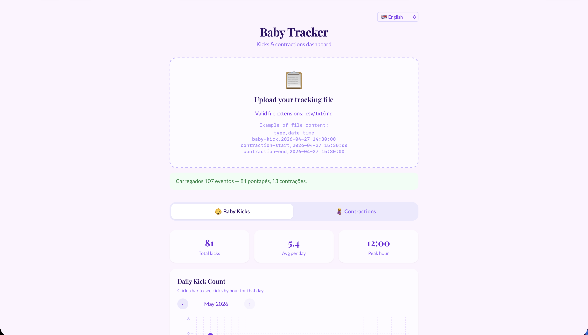
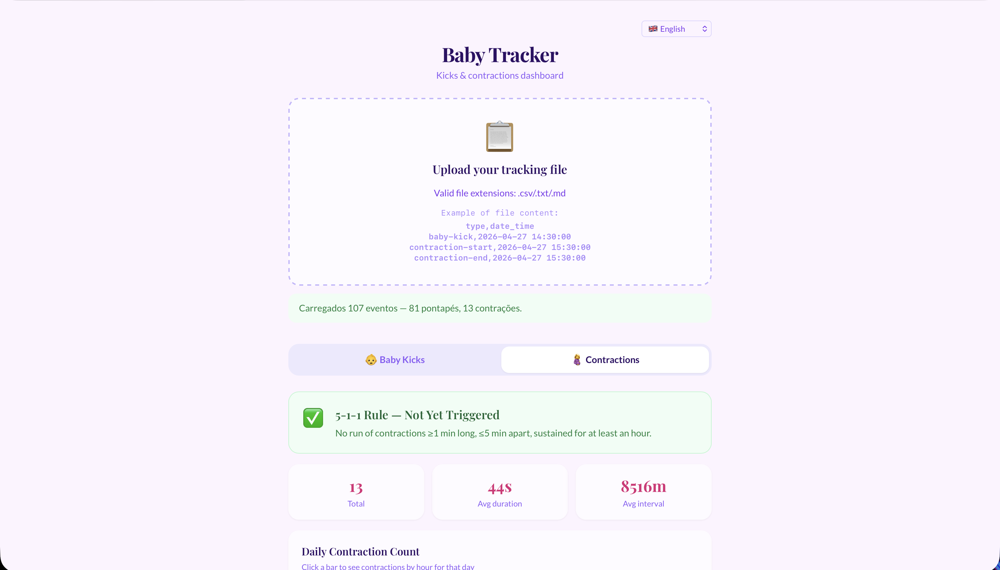
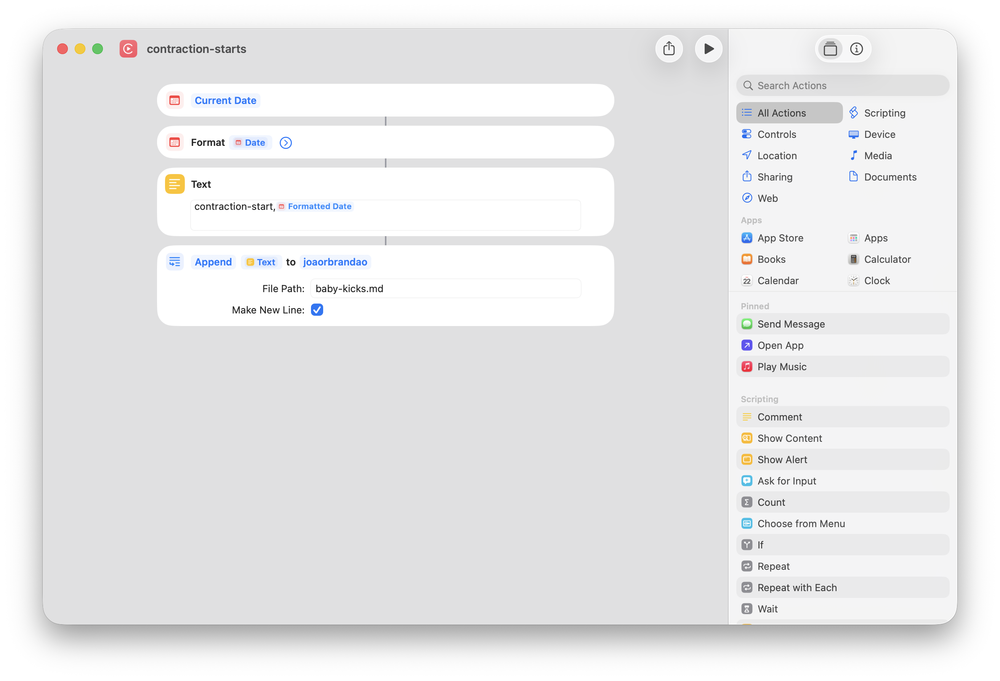
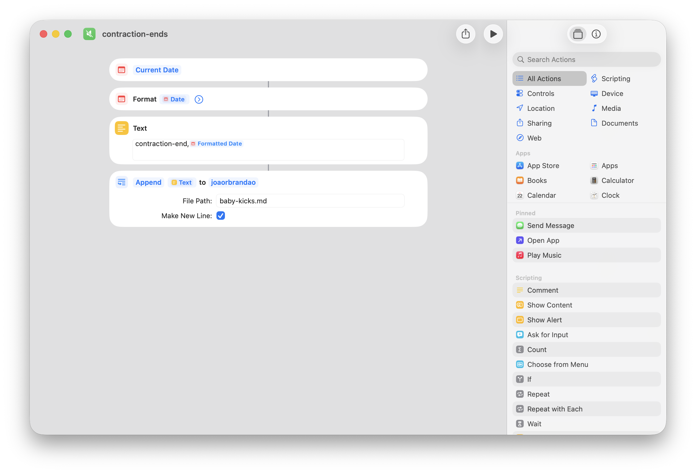

# 👶 Baby Tracker

A privacy-first PWA for tracking and visualizing baby kicks and contractions.

🔗 **Live app:** [joaorbrandao.github.io/baby-tracker](https://joaorbrandao.github.io/baby-tracker/)

> **🔒 100% client-side** — your data never leaves your browser. No servers, no accounts, no tracking.

## Screenshots

### Baby Kicks



### Contractions

 |

## Features

- 🦶 **Baby kick analytics** — daily count, by-hour breakdown, time-of-day periods, peak hour detection
- 🤰 **Contraction tracking** — duration, intervals, daily counts with drill-down by hour
- 🚨 **5-1-1 rule alert** — automatic detection of labor pattern (contractions ≥1 min, ≤5 min apart, sustained for 1 hour)
- 🌐 **Bilingual** — English and Portuguese
- 📱 **PWA** — installable on your home screen, works offline
- 📂 **Drag-and-drop upload** — supports `.csv`, `.txt`, and `.md` files

## Data Collection

You can record events on your iPhone using **Siri Shortcuts** (recommended) or **Scriptable** scripts, then upload the file to the web app.

### Option A: Siri Shortcuts (recommended)

Create 3 shortcuts in the iOS **Shortcuts** app — one for each event type. Each shortcut:

1. Gets the **Current Date**
2. **Formats** it as `yyyy-MM-dd HH:mm:ss`
3. Creates a **Text** block: `event-type, Formatted Date`
4. **Appends** the text to a file in iCloud Drive (e.g. `baby-kicks.md`)

> **⚠️** Make sure to add to your iCloud drive to be backed up and you don't lose everything!

| baby-kicks | contraction-starts | contraction-ends |
|:---:|:---:|:---:|
|  |  |  |

> **Tip:** Add your shortcuts to a widget, the Lock Screen, or trigger them with the Action Button for one-tap recording.

**Important:** The first line of the file must be the header `type,date_time`. You can add it manually once when creating the file, or let the Scriptable alternative handle it automatically.

### Option B: Scriptable scripts

The repository includes ready-to-use [Scriptable](https://scriptable.app/) scripts in [`scripts/scriptable/`](scripts/scriptable/):

| Script | Event type |
|--------|-----------|
| [`kick.js`](scripts/scriptable/kick.js) | `baby-kick` |
| [`contraction-start.js`](scripts/scriptable/contraction-start.js) | `contraction-start` |
| [`contraction-end.js`](scripts/scriptable/contraction-end.js) | `contraction-end` |

**Setup:**

1. Install the free [Scriptable](https://apps.apple.com/app/scriptable/id1405459188) app
2. Copy the script contents into Scriptable
3. Run via Scriptable widget or Siri Shortcuts integration

The scripts automatically create `/baby-tracker.csv` in your iCloud Drive Documents folder (with headers) and append new rows on each run.

## Data Format

The app expects a file with two columns:

```csv
type,date_time
baby-kick,2026-04-27 14:30:00
contraction-start,2026-04-27 15:30:00
contraction-end,2026-04-27 15:31:05
baby-kick,2026-04-27 16:00:00
```

| Field | Values |
| ------- | -------- |
| `type` | `baby-kick`, `contraction-start`, `contraction-end` |
| `date_time` | `yyyy-MM-dd HH:mm:ss` (local time) |

Accepted file extensions: `.csv`, `.txt`, `.md`

## Development

```bash
npm install
npm run dev       # Start dev server
npm run build     # Production build
npm run preview   # Preview production build
```

Deployed automatically to GitHub Pages via GitHub Actions on push to `main`.

